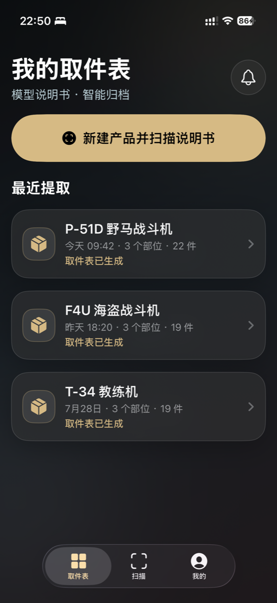
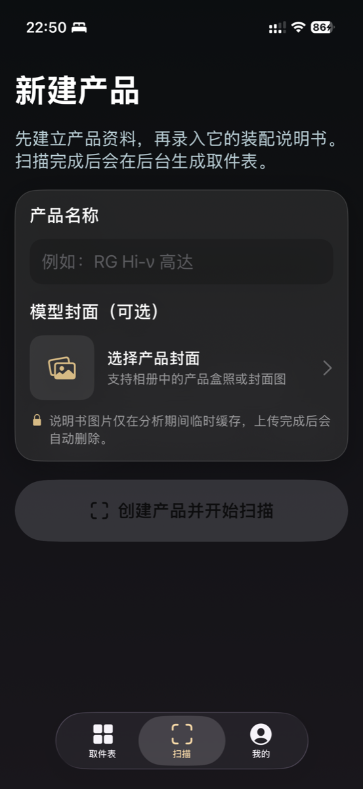
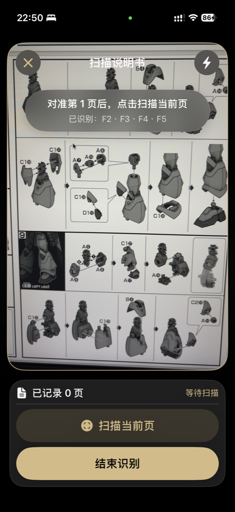
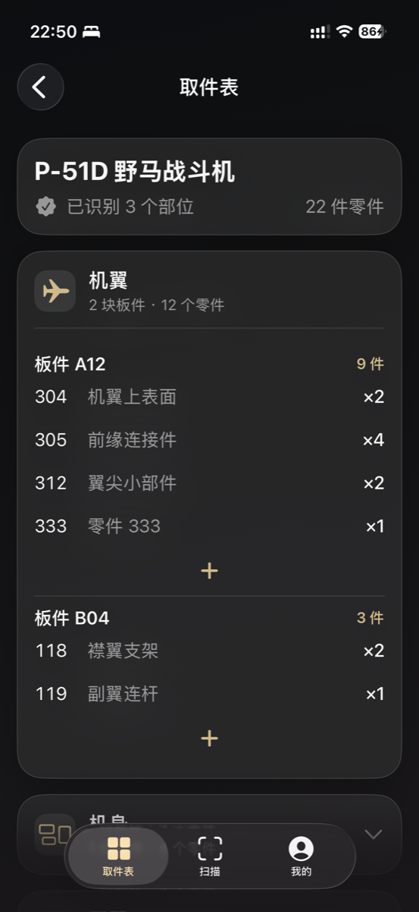
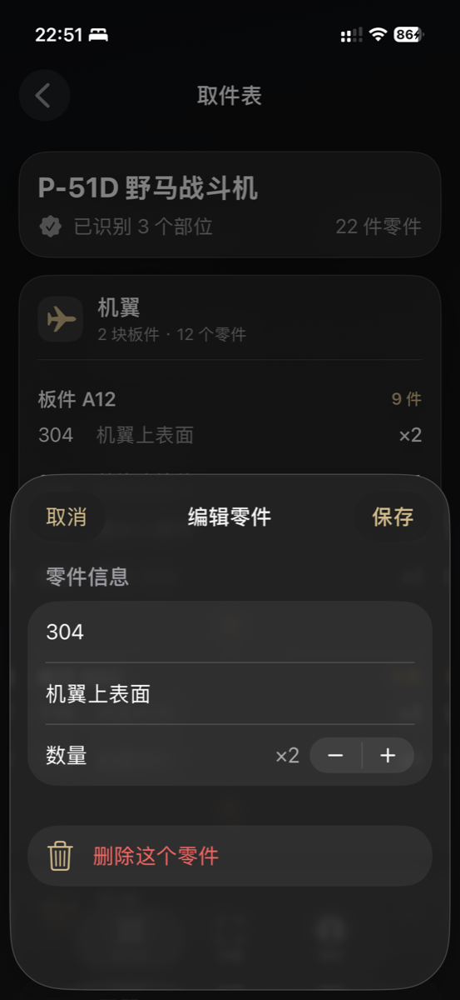
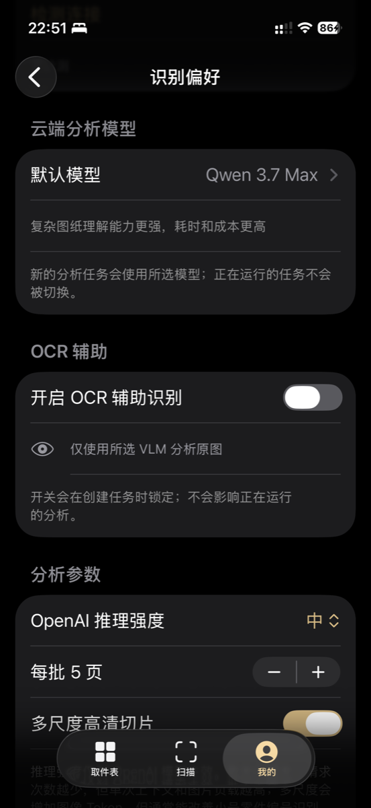
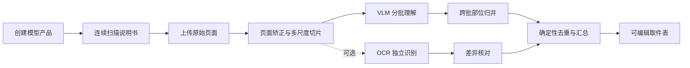

<div align="center">

# PartScan · 取件表

### 把一本模型说明书，变成可以直接照着取件的结构化清单

基于视觉大模型的 iOS 模型说明书扫描与取件表生成工具。

[](https://developer.apple.com/ios/)
[](https://www.swift.org/)
[](https://nestjs.com/)
[](https://www.typescriptlang.org/)
[](#支持的模型)

</div>

---

## 为什么要做 PartScan？

模型拼装前先整理一份“取件表”，可以显著减少在板件之间反复查找零件的时间。理想的取件表应该清楚表达：

> **一个模型部位 → 使用哪些板件 → 每块板件需要哪些零件编号与数量**

但目前主动提供取件表的模型厂家并不多，民间整理的取件表也大多需要爱好者逐页翻阅说明书、手工抄录，过程繁琐且容易遗漏。

PartScan 尝试把这件事交给视觉大模型：用户使用 iPhone 连续扫描整本装配说明书，服务端理解页面中的板件字典、零件编号、装配关系和跨页拼装单元，最终生成可追溯、可人工修订的结构化取件表。

## 产品体验

<table>
  <tr>
    <td align="center"></td>
    <td align="center"></td>
    <td align="center"></td>
  </tr>
  <tr>
    <td align="center"><b>模型归档</b><br/>查看已经生成的取件表</td>
    <td align="center"><b>录入说明书</b><br/>创建产品、选择封面并开始扫描</td>
    <td align="center"><b>连续扫描</b><br/>对准页面，逐页记录整本说明书</td>
  </tr>
</table>

<table>
  <tr>
    <td align="center"></td>
    <td align="center"></td>
    <td align="center"></td>
  </tr>
  <tr>
    <td align="center"><b>结构化清单</b><br/>按部位、板件和零件编号展示</td>
    <td align="center"><b>人工校正</b><br/>长按零件修改编号、说明和数量</td>
    <td align="center"><b>识别偏好</b><br/>切换模型、OCR、批大小与多尺度切片</td>
  </tr>
</table>

## 核心能力

- **连续扫描整本说明书**：一次创建产品，连续录入多页装配图。
- **VLM 结构理解**：不只读取文字，还结合板件字典、零件标注与装配过程推断层级关系。
- **多尺度识别**：完整页负责理解结构，重叠高清切片用于识别 `A1(1)`、`G6(8)` 等小号标签。
- **跨页与分批汇总**：说明书自动分批分析，并携带相邻上下文识别跨页拼装单元。
- **确定性合并**：跨批结果按照“板件编号 + 零件编号”去重，保留来源页码。
- **独立 OCR 辅助**：OCR 与 VLM 并行运行；OCR 只用于差异核对，不会直接覆盖视觉模型结果。
- **结果可编辑**：长按零件即可修改编号、说明、数量或删除；每块板件支持手动新增零件。
- **异步任务**：上传后由服务端后台分析，iOS 轮询进度并展示失败原因。
- **密钥隔离**：模型 API Key 只保存在服务端，不进入 iOS 安装包。

## 工作流程



## 技术架构

| 层级 | 技术 | 职责 |
| --- | --- | --- |
| iOS App | SwiftUI、AVFoundation、Vision | 产品创建、相机扫描、设置、任务状态、取件表展示与编辑 |
| API | NestJS、TypeScript | 图片上传、异步任务、Provider 路由、结构化结果与缓存管理 |
| 图像处理 | Sharp | 自动旋转、轻度锐化、完整页与重叠局部切片 |
| VLM | Qwen / OpenAI Responses API | 说明书视觉理解、部位与零件提取、跨批归组 |
| OCR | Qwen OCR / 腾讯云 OCR | 独立文本与坐标识别、结果差异核对 |
| 当前存储 | 本地文件 + 进程内存 | 开发阶段保存说明书页面与运行时元数据 |

## 支持的模型

客户端可以为每次新任务选择模型；正在运行的任务不会被中途切换。

### Qwen

- `qwen3.7-flash`
- `qwen3.7-plus`
- `qwen3.7-max`
- `qwen3.8-max`
- OCR：`qwen3.5-ocr`

### OpenAI

- `gpt-5.6-sol`
- `gpt-5.6-terra`
- `gpt-5.6-luna`

> 模型是否可用取决于云服务账号、地域、API 项目权限与当时的模型目录。ChatGPT/Codex 订阅不能替代 OpenAI Platform API Key。

## 快速开始

### 环境要求

- macOS + Xcode 26 或兼容版本
- iOS 17+
- Node.js 22+
- npm
- 至少一种已配置的 VLM 服务，或使用本地 Mock 模式

### 1. 克隆仓库

```bash
git clone https://github.com/Clarklevis1995/partscan-ios.git
cd partscan-ios
```

### 2. 启动服务端

```bash
cd server
cp .env.example .env
npm install
npm run start:dev
```

默认 `.env.example` 使用：

```env
QWEN_MOCK=true
```

因此不配置外部模型 Key，也可以跑通产品创建、图片上传、任务轮询和取件表返回流程。

服务健康检查：

```bash
curl http://127.0.0.1:3000/v1/health
```

### 3. 运行 iOS App

1. 用 Xcode 打开 `PartScan.xcodeproj`。
2. 选择 iPhone Simulator 或真机。
3. Build & Run。
4. 进入 **我的 → 识别偏好**，填写服务端地址。

模拟器连接本机服务：

```text
http://127.0.0.1:3000/v1
```

真机联调时，iPhone 与 Mac 需要处于同一局域网，并使用 Mac 的局域网 IP：

```text
http://192.168.x.x:3000/v1
```

macOS 查看当前 Wi-Fi IP：

```bash
ipconfig getifaddr en0
```

## 服务端配置

所有密钥只放在 `server/.env`。该文件已经被 Git 忽略，**不要把真实 Key 写入 iOS 客户端或提交到仓库**。

### 基础配置

```env
PORT=3000
API_PREFIX=v1
STORAGE_DIR=./storage
MAX_MANUAL_PAGES=80
MAX_IMAGE_SIZE_MB=12
QWEN_MOCK=false
```

### 阿里云百炼 / Qwen

```env
DASHSCOPE_API_KEY=你的百炼API密钥
DASHSCOPE_BASE_URL=https://dashscope.aliyuncs.com/compatible-mode/v1

QWEN_FLASH_MODEL=qwen3.7-flash
QWEN_PLUS_MODEL=qwen3.7-plus
QWEN_MAX_MODEL=qwen3.7-max-2026-06-08
QWEN_38_MAX_MODEL=qwen3.8-max-preview
QWEN_38_REASONING_EFFORT=medium
QWEN_OCR_MODEL=qwen3.5-ocr
```

### OpenAI

```env
OPENAI_API_KEY=你的OpenAI Platform API密钥
OPENAI_BASE_URL=https://api.openai.com/v1
```

### 腾讯云 OCR

```env
OCR_PROVIDER=tencent
TENCENTCLOUD_SECRET_ID=你的SecretId
TENCENTCLOUD_SECRET_KEY=你的SecretKey
TENCENTCLOUD_REGION=ap-guangzhou
```

如果使用 Qwen OCR：

```env
OCR_PROVIDER=qwen
```

### 客户端动态参数

以下参数不属于固定服务端配置，由 iOS 在创建分析任务时发送：

```json
{
  "model": "qwen3.7-max",
  "useOcr": false,
  "reasoningEffort": "medium",
  "vlmBatchSize": 5,
  "multiScaleEnabled": true
}
```

- `reasoningEffort`：OpenAI 推理强度。
- `vlmBatchSize`：每批处理 1–8 个新页面。
- `multiScaleEnabled`：是否为每页生成高清局部切片。
- `useOcr`：是否运行独立 OCR 辅助流水线。

## Docker 部署

```bash
cd server
docker build -t partscan-api .
docker run -d \
  --name partscan-api \
  --env-file .env \
  -p 3000:3000 \
  -v "$(pwd)/storage:/app/storage" \
  partscan-api
```

验证部署：

```bash
curl http://127.0.0.1:3000/v1/health
```

生产环境应在 NestJS 前增加 HTTPS 反向代理，并配置域名、鉴权、数据库、对象存储与任务队列。

## API 概览

所有接口默认使用 `/v1` 前缀。

| 方法 | 路径 | 用途 |
| --- | --- | --- |
| `GET` | `/health` | 服务健康检查 |
| `POST` | `/products` | 创建产品与可选封面 |
| `GET` | `/products` | 获取产品列表 |
| `POST` | `/products/:id/manual-pages` | 批量上传说明书图片 |
| `DELETE` | `/products/:id/manual-cache` | 手动清除说明书图片 |
| `GET` | `/analysis/models` | 获取可选模型 |
| `POST` | `/products/:id/analysis` | 创建异步分析任务 |
| `GET` | `/analysis/:id` | 查询任务状态 |
| `GET` | `/products/:id/parts-list` | 获取结构化取件表 |
| `POST` | `/testing/ocr?provider=qwen\|tencent` | 开发环境测试单张图片 OCR |

完整接口、请求示例和 OCR 调试方式见 [`server/README.md`](server/README.md)。

## 测试

```bash
cd server

# TypeScript 编译
npm run build

# 单元测试
npm test

# API 端到端测试
npm run test:e2e
```

真实说明书图片测试：

```bash
npm run start:dev

# 在另一个终端执行
MODEL=qwen3.7-flash npm run test:real-image
```

真实模型调用会产生云端 API 费用。

## 项目结构

```text
.
├── PartScan/                 # SwiftUI iOS App
├── PartScan.xcodeproj/       # Xcode 工程
├── docs/screenshots/         # README 产品截图
└── server/
    ├── src/analysis/         # VLM、OCR、分批与汇总流水线
    ├── src/products/         # 产品、图片上传与缓存管理
    ├── manual-test/          # 真实图片测试脚本
    ├── test/                 # API E2E 测试
    └── Dockerfile
```

## 数据与隐私

- 模型 Key 只保存在服务端。
- 当前上传的说明书图片在分析成功或失败后都会保留。
- 只有调用 `DELETE /v1/products/:id/manual-cache` 才会删除对应说明书页面。
- 正式部署时建议使用私有对象存储，并配置生命周期与用户主动删除能力。
- 上传说明书前，请确认你拥有相应内容的使用权。

## 当前状态与路线图

PartScan 目前是一个可运行的原型，核心扫描与 VLM 取件表流水线已经打通。以下能力仍属于下一阶段：

- [ ] PostgreSQL 持久化产品、任务和取件表
- [ ] 用户注册、登录与 JWT 鉴权
- [ ] S3 / COS / OSS 对象存储与生命周期管理
- [ ] Redis + BullMQ 后台任务队列
- [ ] 取件表版本记录与多人校对
- [ ] 云端公开/私有分享
- [ ] 搜索并复用其他用户已经提取的取件表
- [ ] StoreKit 订阅与模型用量计费
- [ ] 导出 PDF、CSV 与打印版取件表

我们的目标不是让 AI 替代模型玩家的判断，而是把最耗时的逐页抄录工作压缩成一次扫描，再把最终确认权交还给用户。

---

<div align="center">

**Scan the manual. Build the model.**

</div>
